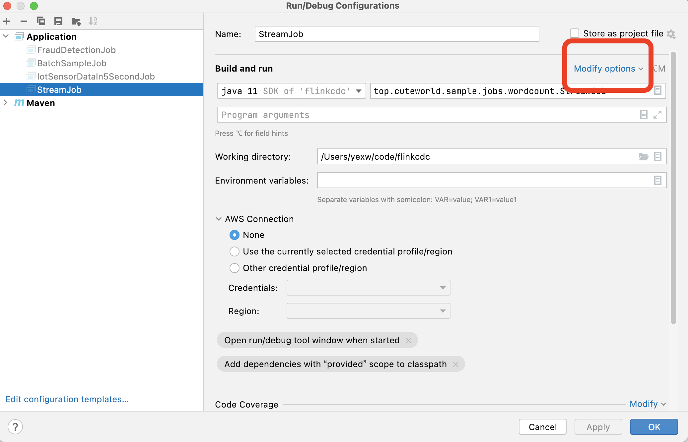
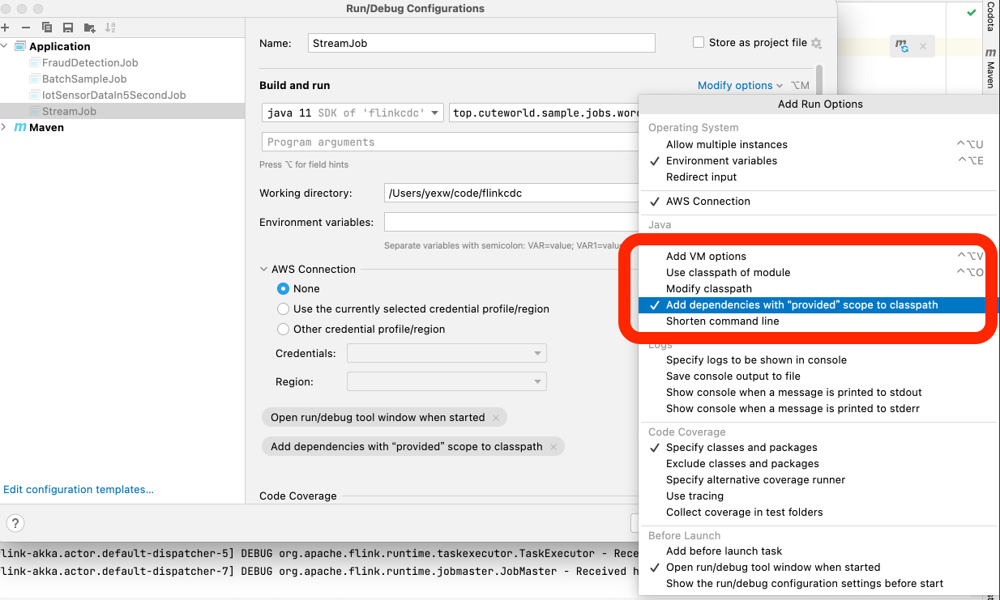

# IDEA本地调试FlinkJob.md

## 修改Run Job Edit Configuration





## 增加 flink-runtime-web， 支持web访问

```bash
org.apache.flink.util.FlinkException: The module flink-runtime-web could not be found in the class path. Please add this jar in order to enable web based job submission.
	at org.apache.flink.runtime.webmonitor.WebMonitorUtils.loadWebSubmissionExtension(WebMonitorUtils.java:191)
	at org.apache.flink.runtime.dispatcher.DispatcherRestEndpoint.initializeWebSubmissionHandlers(DispatcherRestEndpoint.java:110)
	at org.apache.flink.runtime.webmonitor.WebMonitorEndpoint.initializeHandlers(WebMonitorEndpoint.java:275)
	at org.apache.flink.runtime.dispatcher.DispatcherRestEndpoint.initializeHandlers(DispatcherRestEndpoint.java:87)
	at org.apache.flink.runtime.rest.RestServerEndpoint.start(RestServerEndpoint.java:180)
```

增加以下pom依赖

```xml

<dependency>
    <groupId>org.apache.flink</groupId>
    <artifactId>flink-runtime-web</artifactId>
    <version>${flink.version}</version>
    <scope>provided</scope>
</dependency>
```

启动任何后在日志里面搜索, 点击打开

```bash
#关键字： Web frontend listening
INFO org.apache.flink.runtime.dispatcher.DispatcherRestEndpoint - Web frontend listening at http://localhost:53970.
```

### 完整pom参考

```xml
<?xml version="1.0" encoding="UTF-8"?>
<project xmlns="http://maven.apache.org/POM/4.0.0" xmlns:xsi="http://www.w3.org/2001/XMLSchema-instance"
         xsi:schemaLocation="http://maven.apache.org/POM/4.0.0 https://maven.apache.org/xsd/maven-4.0.0.xsd">
    <modelVersion>4.0.0</modelVersion>
    <groupId>top.cuteworld.sample</groupId>
    <artifactId>flinkcdc</artifactId>
    <version>0.0.1-SNAPSHOT</version>
    <name>flinkcdc</name>
    <description>Learning project for flink cdc</description>
    <properties>
        <maven.compiler.source>1.8</maven.compiler.source>
        <maven.compiler.target>1.8</maven.compiler.target>
        <flink.version>1.16.0</flink.version>
        <start.class>top.cuteworld.sample.jobs.watermark.IotSensorDataIn5SecondJob</start.class>
    </properties>
    <dependencies>
        <dependency>
            <groupId>org.apache.flink</groupId>
            <artifactId>flink-runtime-web</artifactId>
            <version>${flink.version}</version>
            <scope>provided</scope>
        </dependency>

        <dependency>
            <groupId>org.apache.flink</groupId>
            <artifactId>flink-walkthrough-common_2.11</artifactId>
            <version>1.14.3</version>
        </dependency>
        <!-- https://mvnrepository.com/artifact/org.apache.flink/flink-streaming-java -->
        <dependency>
            <groupId>org.apache.flink</groupId>
            <artifactId>flink-streaming-java</artifactId>
            <version>${flink.version}</version>
            <scope>provided</scope>
        </dependency>
        <!-- https://mvnrepository.com/artifact/org.apache.flink/flink-clients -->
        <dependency>
            <groupId>org.apache.flink</groupId>
            <artifactId>flink-clients</artifactId>
            <version>${flink.version}</version>
            <scope>provided</scope>
        </dependency>
    </dependencies>


    <profiles>
        <profile>
            <id>spring</id>
            <build>
                <plugins>
                    <plugin>
                        <groupId>org.springframework.boot</groupId>
                        <artifactId>spring-boot-maven-plugin</artifactId>
                        <configuration>
                            <excludes>
                                <exclude>
                                    <groupId>org.projectlombok</groupId>
                                    <artifactId>lombok</artifactId>
                                </exclude>
                            </excludes>
                        </configuration>
                    </plugin>
                </plugins>
            </build>
        </profile>

        <profile>
            <id>flink</id>
            <activation>
                <activeByDefault>true</activeByDefault>
            </activation>
            <build>
                <plugins>
                    <plugin>
                        <groupId>org.apache.maven.plugins</groupId>
                        <artifactId>maven-shade-plugin</artifactId>
                        <version>3.1.1</version>
                        <executions>
                            <execution>
                                <phase>package</phase>
                                <goals>
                                    <goal>shade</goal>
                                </goals>
                                <configuration>
                                    <artifactSet>
                                        <excludes>
                                            <exclude>com.google.code.findbugs:jsr305</exclude>
                                        </excludes>
                                    </artifactSet>
                                    <filters>
                                        <filter>
                                            <!-- Do not copy the signatures in the META-INF folder.
                                            Otherwise, this might cause SecurityExceptions when using the JAR. -->
                                            <artifact>*:*</artifact>
                                            <excludes>
                                                <exclude>META-INF/*.SF</exclude>
                                                <exclude>META-INF/*.DSA</exclude>
                                                <exclude>META-INF/*.RSA</exclude>
                                            </excludes>
                                        </filter>
                                    </filters>
                                    <transformers>
                                        <transformer
                                                implementation="org.apache.maven.plugins.shade.resource.ManifestResourceTransformer">
                                            <!-- Replace this with the main class of your job -->
                                            <mainClass>${start.class}</mainClass>
                                        </transformer>
                                        <transformer
                                                implementation="org.apache.maven.plugins.shade.resource.ServicesResourceTransformer"/>
                                    </transformers>
                                </configuration>
                            </execution>
                        </executions>
                    </plugin>
                </plugins>
            </build>

        </profile>
    </profiles>


</project>

```

