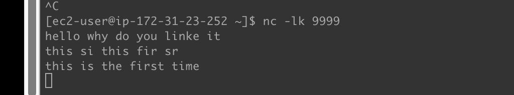
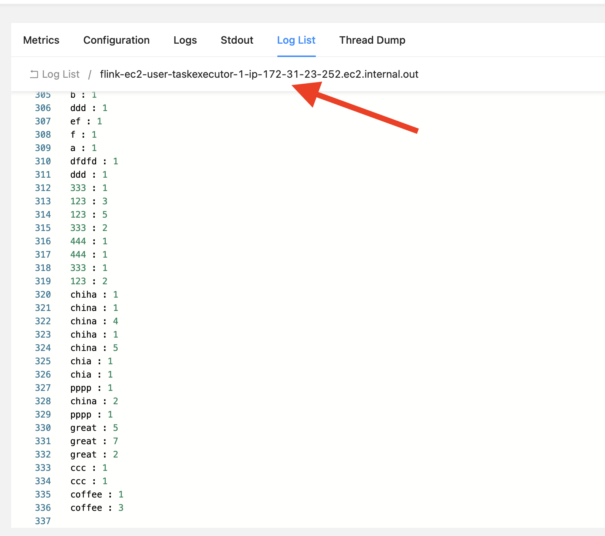

# 第一个Flink job

> 该job会监听来自于9999端口的字符输入，统计后将数字输出到std out

## 环境设置

```bash
mvn clean package -Dmaven.test.skip=true
通过ui web: submit new job 上传target jar
main entry class: top.cuteworld.sample.jobs.wordcount.StreamJob
```

服务器设定：

```bash
sudo yum install nc
nc nc -lk 9999 # -l 监听端口 -k multi connections -t 接受telnet -p 指定端口
# 记得提前指定， 否则submit job很快会转入FAIL
# 然后在当前命令下直接输入单词并回车
```



最后， 你可以在服务上看到输出



### 参考资料

参考：https://aws.amazon.com/cn/blogs/china/using-apache-iceberg-to-build-quasi-real-time-data-warehouse-on-aws/