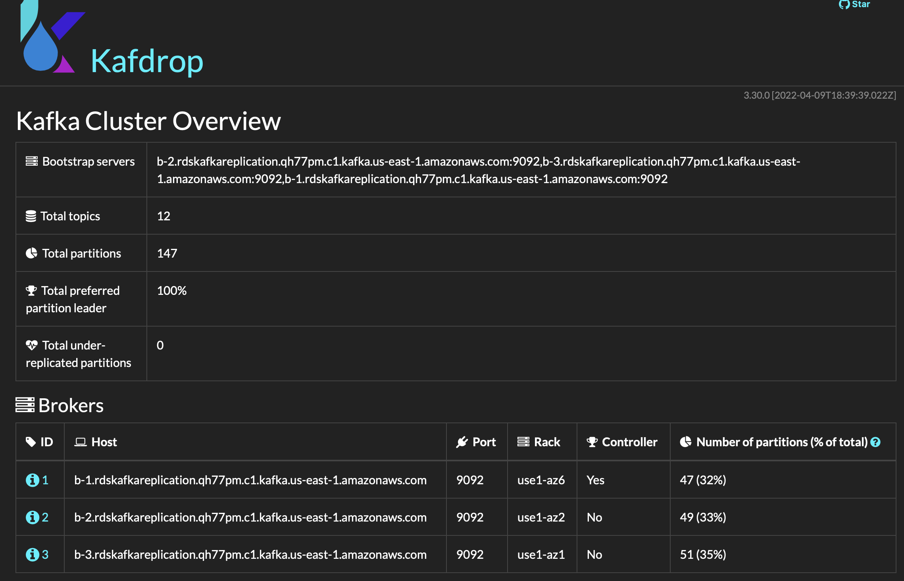

# Kafka的使用

## 安装可视化产品

[Kafdrop – Kafka Web UI ](https://github.com/obsidiandynamics/kafdrop)

```bash
docker run -d --rm -p 9000:9000 \
    -e KAFKA_BROKERCONNECT=b-2.rdskafkareplication.qh77pm.c1.kafka.us-east-1.amazonaws.com:9092,b-3.rdskafkareplication.qh77pm.c1.kafka.us-east-1.amazonaws.com:9092,b-1.rdskafkareplication.qh77pm.c1.kafka.us-east-1.amazonaws.com:9092 \
    -e JVM_OPTS="-Xms32M -Xmx64M" \
    -e SERVER_SERVLET_CONTEXTPATH="/" \
    obsidiandynamics/kafdrop
```

设置ssh转发

```bash
#记得打开security group里面相应的端口
ssh -L 9000:34.207.59.225:9000 ec2-user@34.207.59.225
```


