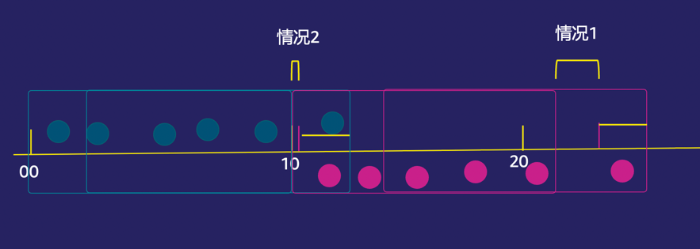
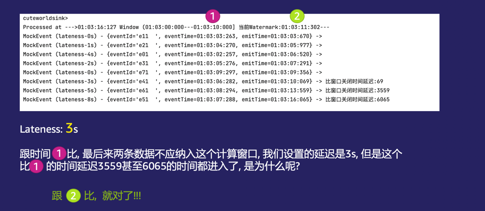

# Lateness到底是怎么算的？

参考代码： top.cuteworld.sample.jobs.lateness.FlinkJobLatenessJob

> 加上另外一个Timer频繁触发产生MockEvent， 从而促使能在window endtime的附近及时触发watermark导致window进入及时计算。 eventTime符合窗口的Event到达触发计算的时间+lateness的时间之内， 则重新计算

## 几个时间

### eventTime

一个事件真实发生的时间， 记录在时间对象内, 客观记录的

### 到达Flink系统的时间

因为网络延迟或者其他原因（在例子里面), Generator故意延迟了发送时间

### Window计算时间

时间窗口被触发的时间， 根据Watermark的机制来触发。 例子中根据实际到达Flink的最大的元素来计算，每200ms定时生成；

## Lateness的关键是什么？

根据以上几个时间, 可以得出

> 如果EventTime到达Flink的时间在 **Window计算时间** 之后， 但是又属于之前的一个时间窗口， 系统会计算到达时间是否 < **window计算时间**+Lateness(一个常量设定)

## 那么请问答以下问题？

针对这样一个时间窗口: 01:20s-01:30s, Lateness为3s, 一个Event, eventTime为 01:28s, 到达flink时间是 01:34, 是否会重新触发窗口计算？

> 你可能的回答， 不会！！！ 因为 01：43 > 01:30 + 3s(lateness), 所以不触发

_**现实情况是: 不一定。**_

情况是:

* （情况1）如果 **Window计算时间** 在 01：32， 那么01:32 + 3s lateness > 1:34, 所以触发窗口计算

* （情况2）如果 **Window计算时间** 在 01：30， 那么01:30 + 3s lateness < 1:34, 所以不触发窗口计算

情况1： 为什么window被触发的这么**晚**呢？ 因为如果没有事件到达flink的话， watermark会等，直到等到一个 事件来临， 而且这个时间大于窗口结束时间.

> 特别是在我们故意做的单线程的模拟延迟数据产生， 非常容易产生这种情况；

情况2： 但是生成环境中， 因为大部分的数据都是正常到达，能够**及时**的产生watermark,且间接确保
**Window计算时间** 无限接近于 Window结束时间.

日志分析
