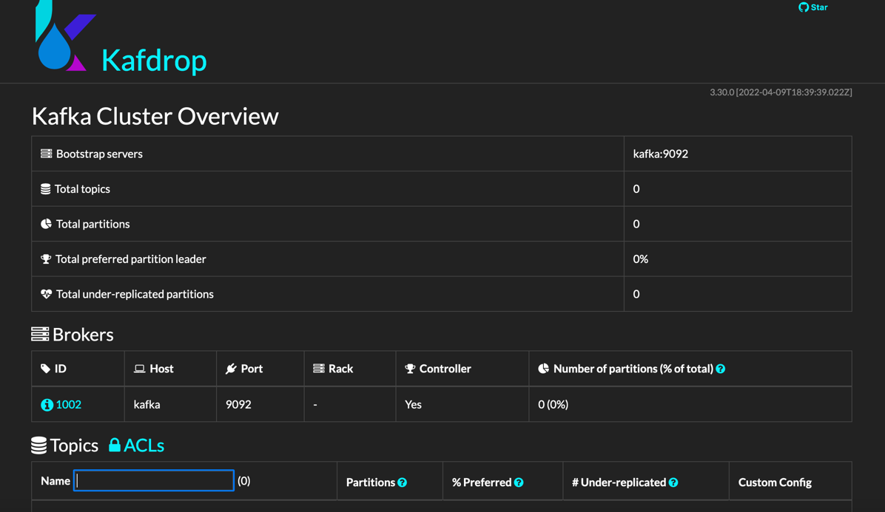

# Flink kafka table

[子模块维护](https://www.jianshu.com/p/9000cd49822c)

## Cloud9 

## kafka table支持属性



```yaml
Supported options:

connector
csv.allow-comments
csv.array-element-delimiter
csv.disable-quote-character
csv.escape-character
csv.field-delimiter
csv.ignore-parse-errors
csv.null-literal
csv.quote-character
csv.write-bigdecimal-in-scientific-notation
format
key.fields
key.fields-prefix
key.format
properties.bootstrap.servers
properties.group.id
property-version
scan.startup.mode
scan.startup.specific-offsets
scan.startup.timestamp-millis
scan.topic-partition-discovery.interval
sink.delivery-guarantee
sink.parallelism
sink.partitioner
sink.semantic
sink.transactional-id-prefix
topic
topic-pattern
value.fields-include
value.format
```

## 关键

```bash
git submodule update --remote --merge

```